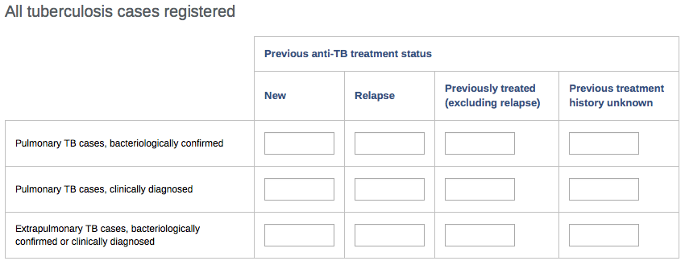
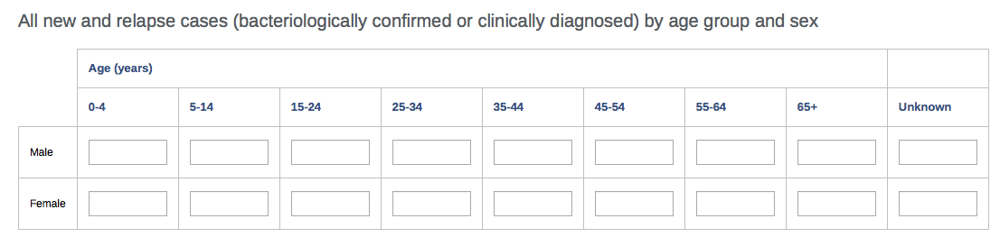
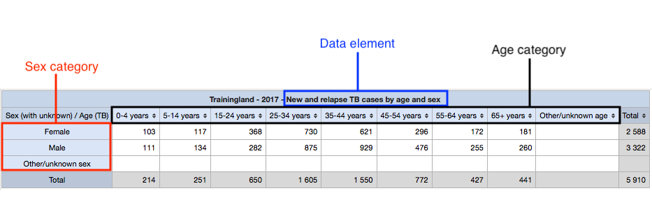
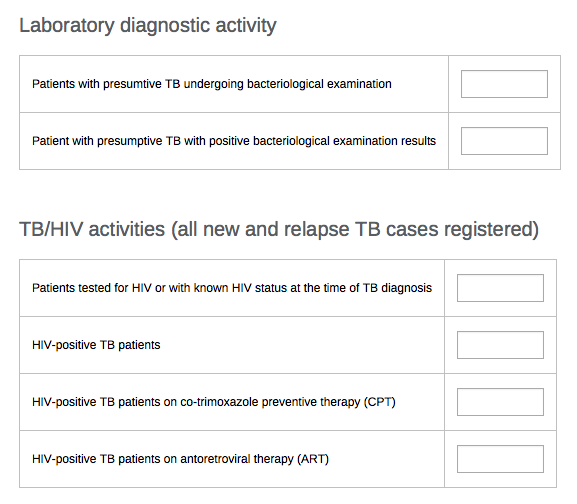
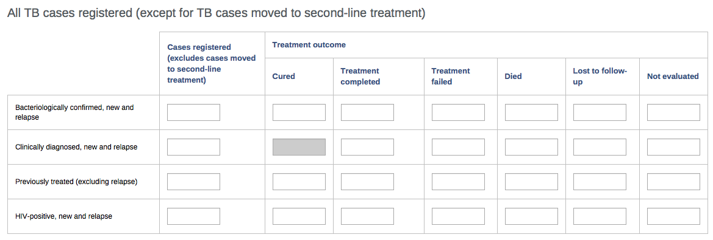
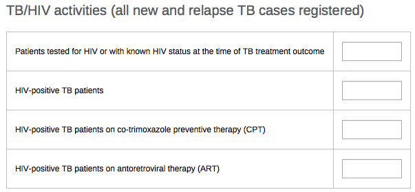
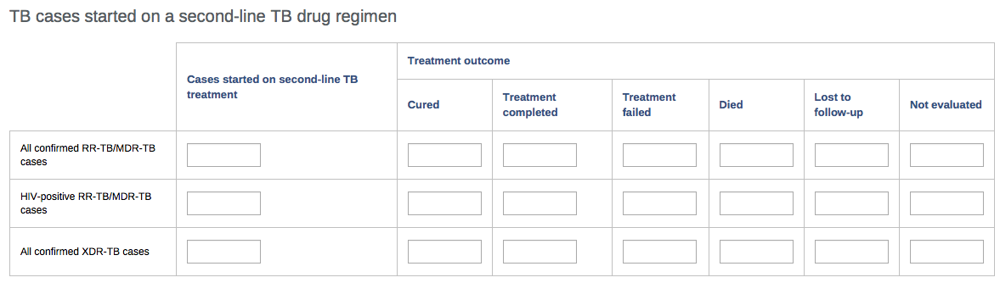
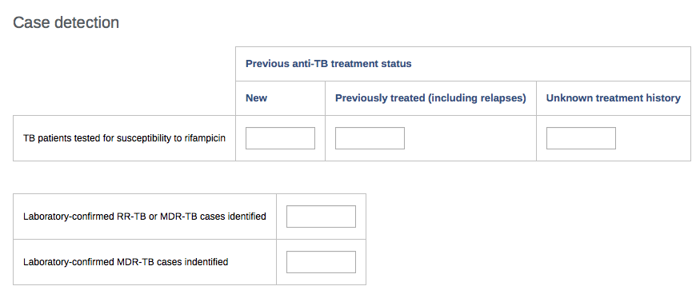
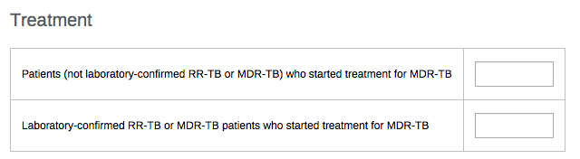

# TB Notifications and Outcomes Design { #tb-agg-no-design }

## Introduction

This document describes the system design for TB programmes to integrate routine aggregate reporting into the HMIS. Depending on national context, these data may be populated by paper-based reporting or by aggregating data from electronic individual-level systems such as DHIS2 Tracker or other tools. The dashboards are designed to support the [WHO's Analysis and use of health facility data: guidance for tuberculosis programme managers (2018)(https://www.who.int/publications/m/item/analysis-and-use-of-health-facility-data-guidance-presentation-for-tuberculosis-programme-managers). 

## Overview

The TB configuration is based on the WHO [Definitions and reporting framework for tuberculosis](http://apps.who.int/iris/bitstream/10665/79199/1/9789241505345_eng.pdf).

|Name|Periodicity|Purpose|
|:--|:--|:--|
|TB case registration|Quarterly|Reporting on new cases of TB (notifications)|
|TB treatment outcomes|Quarterly|Reporting on treatment outcomes of first line treatment|
|TB treatment outcomes - second line|Yearly|Reporting on treatment outcomes of second line treatment|
|RR/MDR-TB case detection and treatment|Yearly|Reporting on new cases of drug-reistant TB|

## Data set structure and design

This section will for each data set present the main sections (tables) of the data sets (reporting forms), explaining how and why they have been configured.

### TB case registration

#### Case registration

The case registration table has been set up as 12 individual data elements. This table could conceivable also have been set up as three data elements with “Previous anti-TB treatment staus” as a data element category. There are a few reasons why a “flat” structure with individual data elements was chosen:

* As noted above, it has been important to have a structure for the TB configuration package that allows comparisons with the previous reporting framework. Using a flat structure allow certain fields (data elements) in this section to be reused in the previous version of the case registration form.
* Analysis of this data is often done on specific combinations of these rows and columns, which have been defined as indicators. Using a category for treatment status would make it easier to replicate the above table “as-is”, but this seems less relevant. If necessary, this could be re-created using data element group sets.
* A “previous anti-TB treatment status” category would only apply to 3 data elements. While including a similar concept/classification of previous treatment, both the data set for drug resistant TB and the previous reporting framework is structured differently so that the cateogry could not be used there.

#### Case registration by age and sex

This section/table has been configured as a single data element, with an “age and sex” category combination. Even though the age category only applies to a single data element, this allows maximum flexibility in the analysis tools, as shown in the example below:

#### Data validation

A validation rule has been configured that checks the number of new and relapse cases reported in the “Case registration” to the number reported by age and sex.

### Lab activity and TB/HIV

These two sections/tables have been configured as individual data elements. 

#### Data validation

Validation rules have been configured for these checks:

* Lab examinations done ≥ positive results
* HIV status known ≥ status positive
* HIV status positive ≥ CPT/ART

### TB treatment outcomes

#### Treatment outcomes

The treatment outcomes table (which applies to first line treatment only) is categorised by the type of TB case (bacteriological confirmed, clinical, previously treated, HIV positive). For each category of patient, the table includes the number of cases registered (i.e. the treatment cohort) and the treatment outcome. Each category of patients is configured in DHIS2 as one data element for the cases registered/cohort, and one for treatment outcomes. The treatment outcome data elements have a “TB treatment outcome” category with each of the 6 treatment outcomes. 

First of all, it is clear that having **one** data element for each category of TB case would not make sense, as it would include both the cohort and the number of reported outcomes, i.e. the total of the category would not make sense, which is the general rule. However, the table _could_ have been set up with each field being an individual data element. The reason why a category was chosen includes:

* The general recommendations for categories is that the sum of all options should make sense, as it is the total that is showed by default in the reporting tools. While the total in this case might not be particularly useful (it is essentially the total number of evaluated outcomes), it is a meaningful number. For comparison, a common example of a category that most often does not make sense is “cases and deaths”. 
* When including current and old forms, first and second line, the treatment outcome category applies to 13 case categories. Using a category thus helps reduce the number of data elements from 78 to 13.
* Using a category maximises the flexibility when analysing the treatment outcome data. For example, the total number of outcomes with “treatment success” (which is defined as the sum of “cured” and “treatment completed”) can be shown simply by setting up a filter with two category options.

#### Data validation

Validation rules have been set up verifying that the size of the cohort (cases registered) is the same as the number of treatment outcomes reported.

#### TB/HIV

The TB/HIV section/table of the treatment outcomes data set closely resembles the TB/HIV section of the case registration form. It is included because often the HIV status of a significant proportion of cases may not yet be known at the time the quarterly notification report is compiled. The TB/HIV section of the treatment outcomes report enables collection of the complete information about HIV status. It has the similar variables related to HIV status, but uses separate data elements with a “(by time of outcome)” postfix to separate them. The same validation rules apply here as on the TB/HIV table in the Case registration dataset.

### TB treatment outcomes - second line

#### Treatment outcomes

The treatment outcomes for cases on second-line regimen has been configured in the same way as described above, and with the same validation rules.

### RR/MDR-TB case detection and treatment

#### Case detection

The case detection section/table is configured with individual data elements.

#### Data validation

A data validation rule checks that the number RR-TB or MDR-TB cases is more than the number of MDR-TB cases only.

#### Treatment

The treatment section/table is configured with individual data elements.
